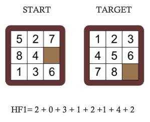

# AAsteriskUCB
 
The present repository contains an implementation of the well-known A* algorithm
to solve the 8-puzzle problem. The algorithm and interface were programmed with 
Java Swing and NetBeans, on the other hand, the program can also process 
new puzzle background images.  

The project itself was a personal initiative to implement the A* algorithm for the
module INF-361 Artificial Intelligence @ [UCB](https://lpz.ucb.edu.bo/). 
  
## About the 8-puzzle problem

The problem assigns a number to each cell, which is the sum of vertical and
horizontal distances between the current and target cell's position. The heuristic 
function tries to reduce the total sum of these distances excluding the empty cell.  
 

## About the A* algorithm 

Artificial Intelligence is a branch of Computer Science, which studies methods
to create machines capable of performing human-like tasks. Finding computationally
 the optimal path from an origin state to a target state has been studied since 
the advent of computers. This algorithm was created in 1968 indeed, and other
advanced pathfinding algorithms have overpassed its results but the algorithm
is still functional in certain contexts. For example, when working with 2D matrices
or graphs. 

Still, the A* has some disadvantages when the solution space is wide. This might 
affect the memory and cause it runs out of resources. The created project might
help to evaluate the A* performance against Jump Point Search, Dijkstra, and so on. 

## Demo 

## Installation Manual 
- Download project
- Launch project with [Apache NetBeans 12.2](https://netbeans.apache.org/download/index.html) 

